# Projet Health — Application mobile de suivi e-santé

Application mobile cross-platform développée en **Flutter / Dart**, connectée à une API REST (CMS Directus, `https://health.shrp.dev`), dans le cadre du module *Interfaces utilisateurs et composants* — M1 Sciences Cognitives, IDMC.

L'application s'adresse à un **professionnel de santé** (médecin, nutritionniste, coach sportif…) : elle permet de consulter la liste de tous les patients et de suivre leur évolution physique, physiologique et psychique.

---

## 👥 Membres du groupe

- Sana Haidar
- Rouba Rizkallah


---

## ✨ Fonctionnalités

### Fonctionnalités principales
-  **Liste des patients** (écran Master) avec recherche en temps réel.
-  **Détails d'un patient** (écran Details) récupérés à partir de son identifiant.
-  **Suivi des activités physiques** (pas, durée, calories).
-  **Évolution physiologique** (suivi du poids).
-  **Visualisation graphique** de l'évolution du poids et de l'historique d'activités (package `fl_chart`).

### Fonctionnalités optionnelles implémentées
-  **Authentification** d'un professionnel de santé (formulaire de connexion, récupération du JWT).
-  **Données psychiques** : accès à l'endpoint privé `/items/psychicData` via token Bearer.
-  **Conservation de l'access_token** (SharedPreferences).
-  **Rafraîchissement automatique** du token via le refresh_token (intercepteur Dio).
-  **Affichage de l'état de connexion** de l'utilisateur courant.
-  **Déconnexion** (Sign Out).

---

## 🛠️ Stack technique

| Domaine | Technologie |
|---|---|
| Framework | Flutter / Dart |
| Navigation | Go Router |
| Client HTTP | Dio (singleton + intercepteur) |
| Gestion d'état | Provider (état global) + setState (état local) |
| Graphiques | fl_chart |
| Stockage local | shared_preferences |
| Backend | API REST Directus (`https://health.shrp.dev`) |

---

## 🏗️ Architecture

```
lib/
├── main.dart                  # Point d'entrée, MultiProvider + MaterialApp.router
├── router/
│   └── app_router.dart        # Configuration Go Router
├── models/                    # Modèles de données (désérialisation JSON)
│   ├── patient.dart
│   ├── physical_activity.dart
│   ├── physiological_data.dart
│   ├── psychic_data.dart
│   └── auth_user.dart
├── services/                  # Communication avec l'API
│   ├── api_service.dart       # Singleton Dio + intercepteur (Bearer + refresh)
│   ├── patient_service.dart
│   ├── data_service.dart
│   ├── auth_service.dart
│   └── token_storage.dart
├── providers/                 # Stores Provider (état global)
│   ├── patients_provider.dart
│   ├── activities_provider.dart
│   ├── psychic_provider.dart
│   └── auth_provider.dart
└── screens/                   # Écrans (UI)
    ├── master_screen.dart     # Liste des patients
    ├── details_screen.dart    # Détails d'un patient
    ├── charts_screen.dart     # Graphiques (Poids / Activités / Bien-être)
    ├── login_screen.dart
    └── profile_screen.dart
```

---

## 📱 Aperçu de l'application

| Liste des patients (Master) | Détails d'un patient | Évolution du poids |
|:---:|:---:|:---:|
| 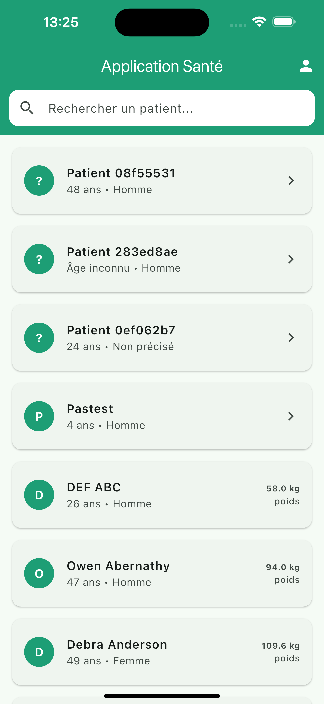 | 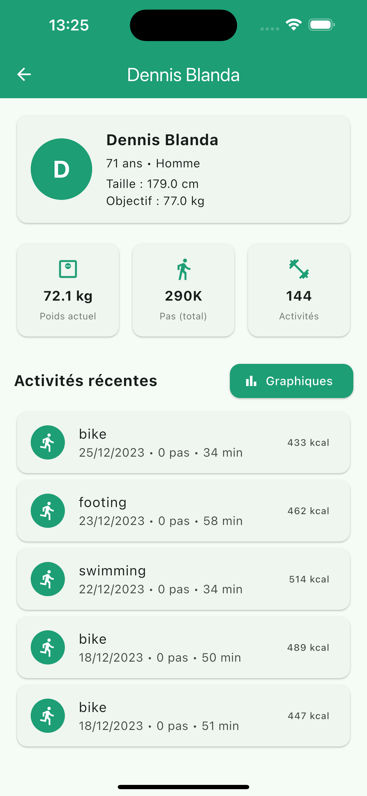 | 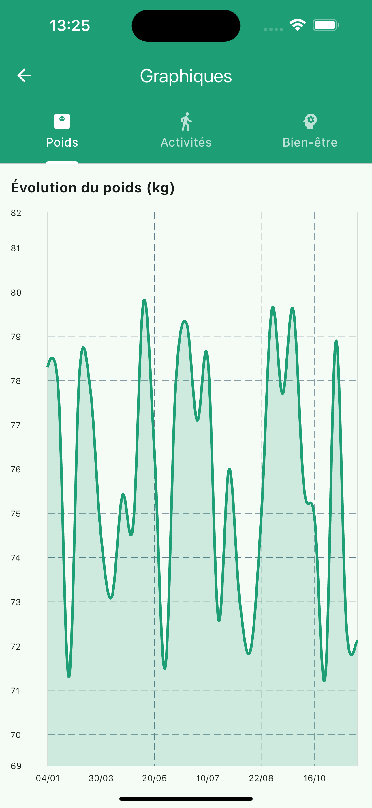 |
| *Recherche en temps réel* | *Statistiques et activités récentes* | *Graphique fl_chart* |

| Bien-être (authentifié) | Bien-être (non authentifié) |
|:---:|:---:|
| 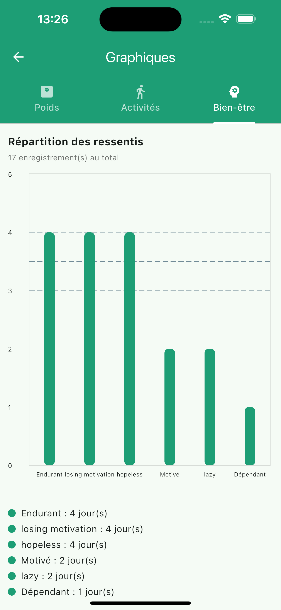 | 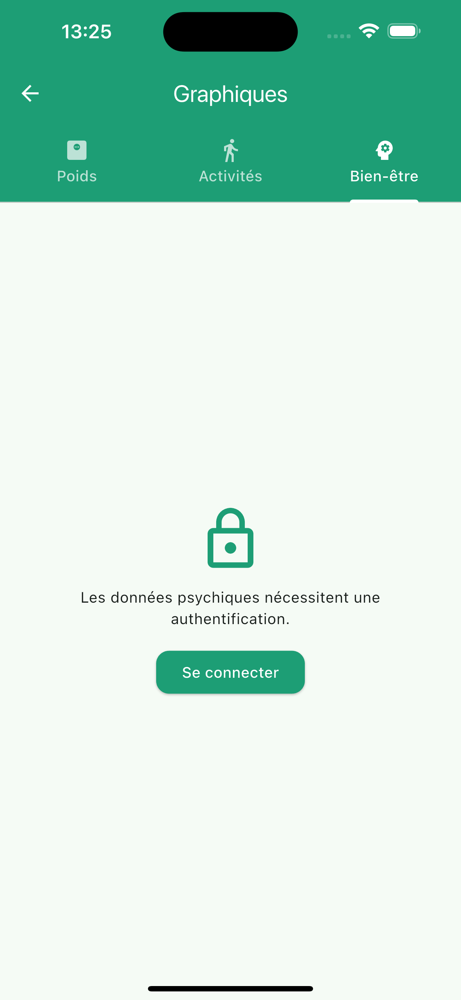 |
| *Répartition des ressentis (données psychiques)* | *Accès restreint sans authentification* |

| Connexion | Profil |
|:---:|:---:|
| 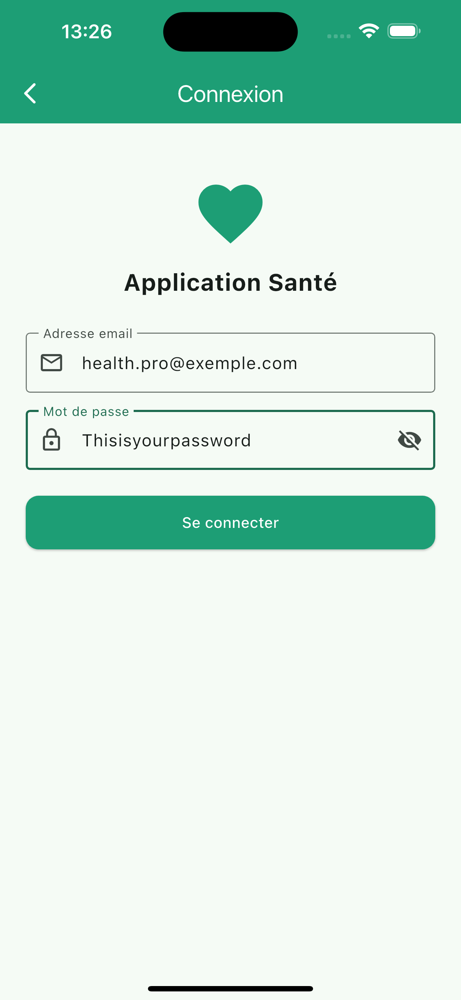 | 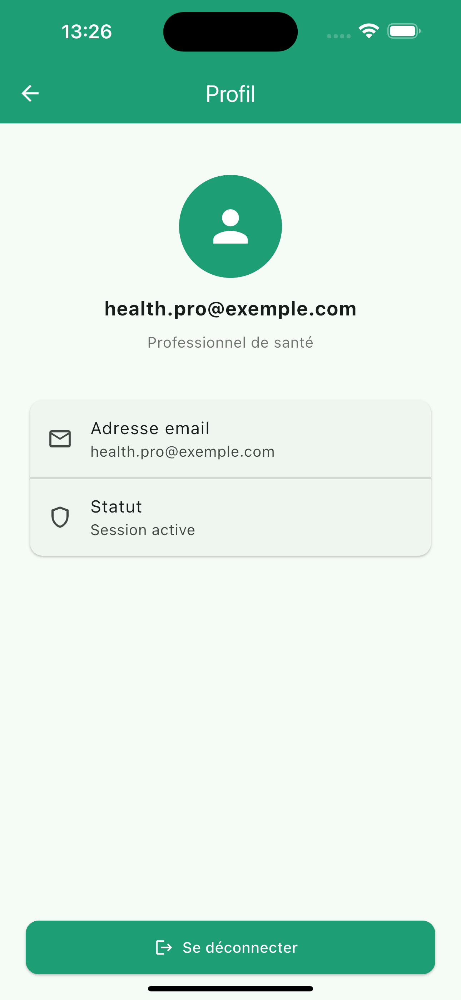 |
| *Formulaire de connexion (JWT)* | *État de connexion et déconnexion* |

> Les deux captures de l'onglet Bien-être illustrent la protection des données
> psychiques au sein de l'application : l'accès est verrouillé tant que
> l'utilisateur n'est pas authentifié.


---

## 🔌 Documentation de l'API

L'API REST (Directus) expose des endpoints **publics** et **privés**.

### Endpoints publics (aucune authentification)
| Méthode | Endpoint | Description |
|---|---|---|
| `GET` | `/items/people` | Liste des patients |
| `GET` | `/items/physicalActivities` | Activités physiques |
| `GET` | `/items/physiologicalData` | Données physiologiques (poids) |

### Endpoint privé (token Bearer requis)
| Méthode | Endpoint | Description |
|---|---|---|
| `GET` | `/items/psychicData` | Données psychiques |

### Authentification
```http
POST https://health.shrp.dev/auth/login
Content-Type: application/json

{ "email": "...", "password": "..." }
```
Réponse : `access_token` + `refresh_token` (JWT). L'access_token est transmis dans le header `Authorization: Bearer <token>` pour accéder aux endpoints privés.

### Filtrage relationnel (Directus)
Les données d'un patient sont filtrées par son identifiant :
```
?filter[people_id][_eq]=<uuid>
```

### Captures Bruno

Les requêtes ont été testées avec le client API **Bruno**. Les captures
ci-dessous illustrent le cycle complet : authentification, accès public,
filtrage relationnel et accès à l'endpoint privé.

| Authentification (`POST /auth/login`) | Liste des patients (`GET /items/people`) |
|:---:|:---:|
| 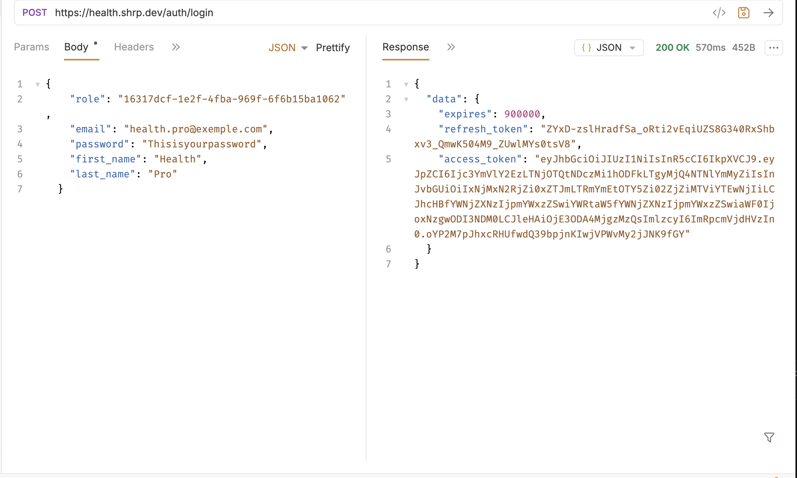 | 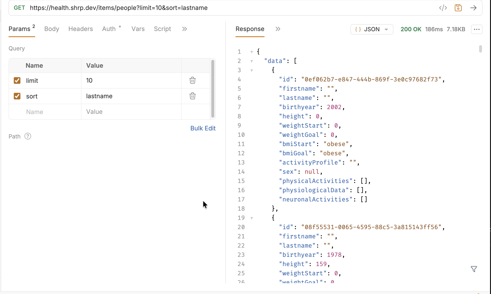 |
| *200 OK — récupération de l'access_token et du refresh_token* | *200 OK — endpoint public, aucune authentification* |

| Activités physiques (`GET /items/physicalActivities`) | |
|:---:|:---:|
| 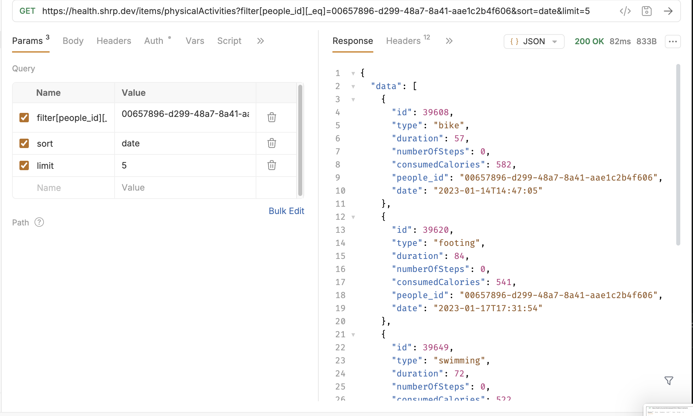 | |
| *200 OK — filtré par `filter[people_id][_eq]`* | |

**Démonstration de la protection de l'endpoint privé `/items/psychicData` :**

| Sans token Bearer | Avec token Bearer |
|:---:|:---:|
| 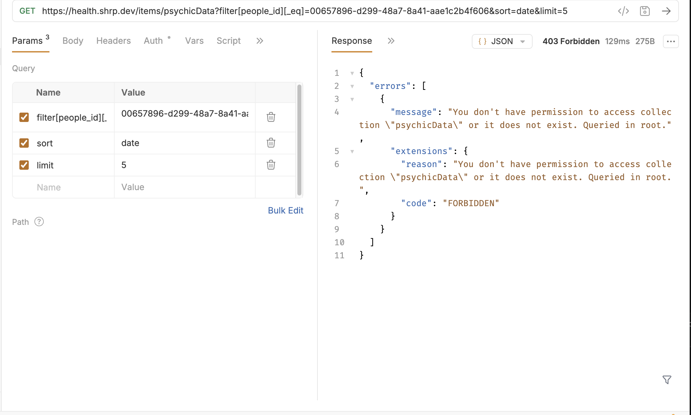 | 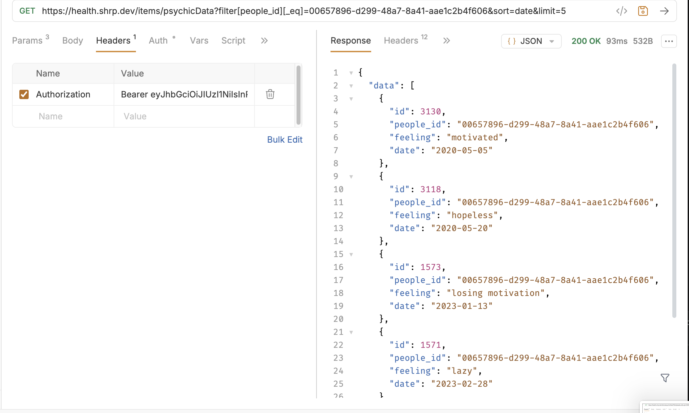 |
| *403 Forbidden — accès refusé* | *200 OK — accès autorisé* |

> Ces deux dernières captures démontrent que l'endpoint psychique est bien
> protégé : l'accès échoue (**403 Forbidden**) sans token, et réussit
> (**200 OK**) avec un token Bearer valide.

---

## 🚀 Installation et lancement

### Prérequis
- Flutter SDK installé ([guide officiel](https://docs.flutter.dev/get-started/install))
- Un émulateur iOS (Xcode) ou Android (Android Studio)

### Étapes
```bash
# Cloner le dépôt
git clone https://github.com/Sana7Codes/Health.git
cd Health

# Récupérer les dépendances
flutter pub get

# Lancer l'application (émulateur ouvert au préalable)
flutter run
```

L'application démarre directement sur la liste des patients. La connexion (professionnel de santé) est nécessaire uniquement pour consulter les données psychiques.

---

## 📝 Note sur l'accès aux données (RGPD)

Dans un contexte professionnel réel, les endpoints exposant des données de santé
(`/items/people`, `/items/physiologicalData`, `/items/physicalActivities`) devraient être privés pour respecter le RGPD. Dans le cadre de ce projet, ils ont été rendus
publics pour faciliter l'accès aux données. Seul l'endpoint des données psychiques est privatisé : l'application implémente donc le flux d'authentification Bearer pour y accéder, conformément aux bonnes pratiques.

---

## 🤖 Utilisation d'outils d'IA

Conformément aux consignes, l'utilisation d'outils d'IA générative est signalée :
ces outils ont été employés à des fins de **documentation, de vérification et de
débogage** (résolution d'erreurs de compilation, de signature iOS, et de mise en
correspondance des modèles de données avec l'API). La conception, l'architecture et
l'implémentation relèvent du travail du groupe.